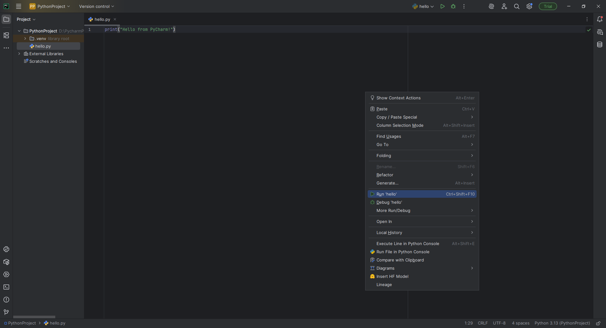
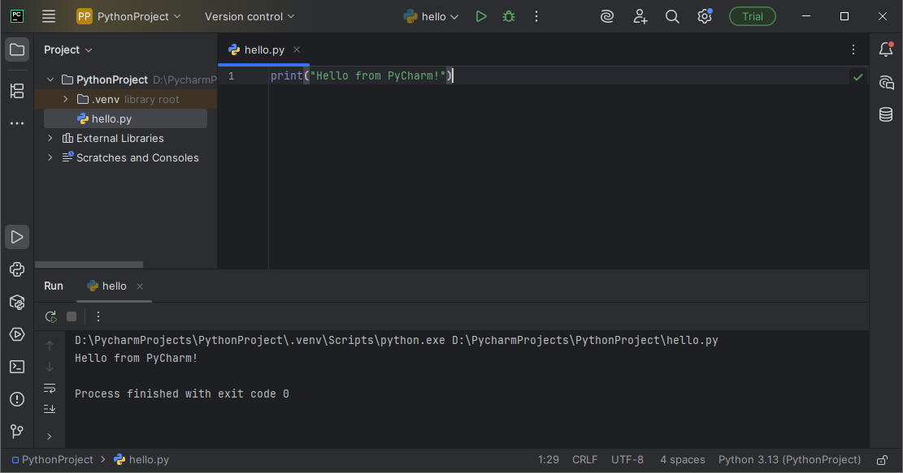

# Setting Up PyCharm for Python

## 🧑‍💻 What is PyCharm?

PyCharm is a popular and beginner-friendly **Integrated Development Environment (IDE)** for Python. It offers a smart code editor, error highlighting, and many features that make writing and running Python code easier.

---

## 🪜 Installation Steps

### 1. Download PyCharm

- Visit: [https://www.jetbrains.com/pycharm/download](https://www.jetbrains.com/pycharm/download)
- Choose **Community Edition** (free version).
- Download and install it like any other app on your system.

### 2. First Launch

- Open PyCharm after installation.
- It may ask to import settings — choose **"Do not import"** if unsure.
- Accept privacy terms and proceed.

### 3. Create Your First Project

- Click on **"New Project"**
- Select a location and name it something like `python_day1`
- Make sure **"New environment using Virtualenv"** is selected
- Confirm that Python is selected as the base interpreter (it should auto-detect)


> ❗ If Python is not detected, install it from [python.org](https://www.python.org/downloads/) first.

### 4. Create Your First File

- Right-click the project > **New → Python File**
- Name it `hello.py`
- Paste your code:


```python
print("Hello from PyCharm!")

### Right-click on the file and click Run 'hello'





🎉 You're now set up and ready to code with PyCharm!
